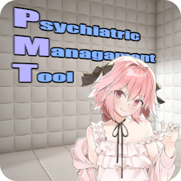

# Psychiatric Management Tool


The psychiatric management tool (PMT) can manage a psychiatric institution, it's patients and rooms. The program is implemented as CLI tool and is easy to use.

###### Table of Contents

1. [Description](#description)
2. [Install and Use the Project](#install-and-use-the-project)
3. [Contributors](#contributors)
4. [License](#license)
5. [How to Contribute](#how-to-contribute)

<br/>

## Description
The PMT allows you to manage an unlimited number of patients within a psychiatric institution. Each patient must be assigned to a crisis intervention area.

###### Used Technologies
The application is developed with Java through the IntelliJ IDEA. Therefore, the project is built using Maven.

The program uses Google Gson for JSON serialization in order to store patient and room data in between sessions.

Furthermore, the project uses JUnit for testing.

###### Concepts and Technologies
The project emphasizes the domain driven design approach, as well as clean architecture. This determines the entire project structure and divides the source code into the following layers:
* **Domain Code:** This layer contains all models as well as domain code. This layer is completely independent from every other source code within the project.
* **Application Code:** This layer contains the main business logic, which includes the implementation of use cases (i.e. services) as well as all CLI commands.
* **Plugin Code:** This layer contains the code which interfaces with external libraries (e.g. Google Gson).

Furthermore, the utilizes code principles like SOLID or GRASP to ensure good code maintainability.

<br/>

## Install and Use the Project

###### Install the Program
If you want to use PMT, you can download the project from GitHub or clone using `git clone https://github.com/Christian-2003/psychiatric-management-tool`.

After cloning the repository, you can open the project using IntelliJ IDEA.

Next, run the main method in the class `de.christian2003.psychiatric.application.PsychiatricManagementTool`.

###### How to Use the Program
After running the main class as described [here](#install-the-program), a CLI opens which allows you to manage your psychiatric institution.

CLI commands have the following structure:
```bat
<command> <arg1 name>=<arg1 value> <arg2 name>=<arg2 value> ...
```

For example, create a new crisis intervention area with the name "RoomForMyPatient" as follows:
```bat
create cia
name=RoomForMyPatient
```

To list all crisis intervention areas that are available within the program, call the following:
```bat
list cias
```
This returns the following result:
```
Crisis Intervention Area ID:         Name:                    Assigned Patient:
34413bc0-3161-467b-97c2-46c022bb489e RoomForMyPatient         None
```

Now, create a patient and assign it to the crisis intervention area:
```bat
create patient
    firstname=John
    lastname=Doe
    birthday=2001-09-11
    cia=34413bc0-3161-467b-97c2-46c022bb489e
```

For further help, call the `help` command. This provides a list of all CLI commands, parameters as well as examples.

<br/>

## Contributors
Currently, I ([Christian-2003](https://github.com/Christian-2003)) am the only developer, since this is a project for university.

<br/>

## License
The project is licensed under the terms and conditions of the MIT license. You can view a copy of the license [here](LICENSE.txt).

<br/>

## How to Contribute
This is a project for university. Therefore, nobody besides the mentioned contributers are allowed to contribute to the project.

Feel free to fork the repository if you want to change the code.

<br/>

***
2025-04-29  
&copy; Christian-2003
